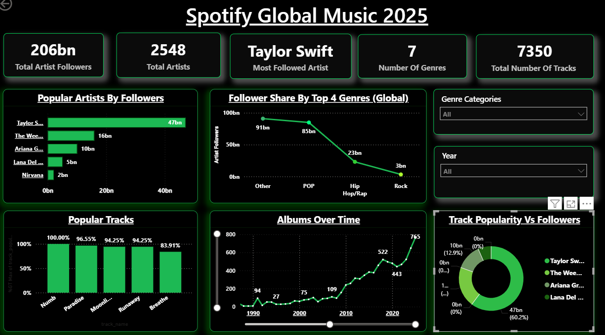

# 🎵 Spotify Global Streaming Analysis | Power BI

---

## 📌 Project Overview

This project presents an interactive Power BI dashboard analyzing global Spotify streaming data to uncover trends in artist performance, genre popularity, and regional listening behavior.

---

## 🎯 Business Objectives

- Analyze global streaming trends
- Identify top-performing artists and tracks
- Understand genre distribution patterns
- Compare streaming behavior across regions
- Discover key drivers of music popularity

---

## 🛠 Tools & Technologies Used

- Power BI
- Data Modeling
- DAX Calculations
- Data Cleaning
- Interactive Dashboard Design
- Business Intelligence

---

## 📊 Dashboard Features

✔ Total Streams & Popularity KPIs  
✔ Top Artists Analysis  
✔ Genre Distribution Breakdown  
✔ Regional Streaming Comparison  
✔ Trend Analysis Over Time  
✔ Interactive Filters & Slicers  

---

## 📈 Key Insights

- A small group of artists dominates global streaming share.
- Certain genres consistently outperform others across multiple regions.
- Regional preferences significantly influence popularity rankings.
- Streaming concentration varies across global markets.

---

## 💼 Business Impact

This dashboard enables data-driven decisions for:

- Artist promotion strategies
- Genre-focused marketing campaigns
- Regional content optimization
- Strategic distribution planning

---

## 🖼 Dashboard Preview

  

---

## 📂 Repository Contents

- `Spotify Global Analysis.pbix` – Power BI dashboard file  
- `SpotifyDashboard.png` – Dashboard preview image  
- `README.md` – Project documentation  
